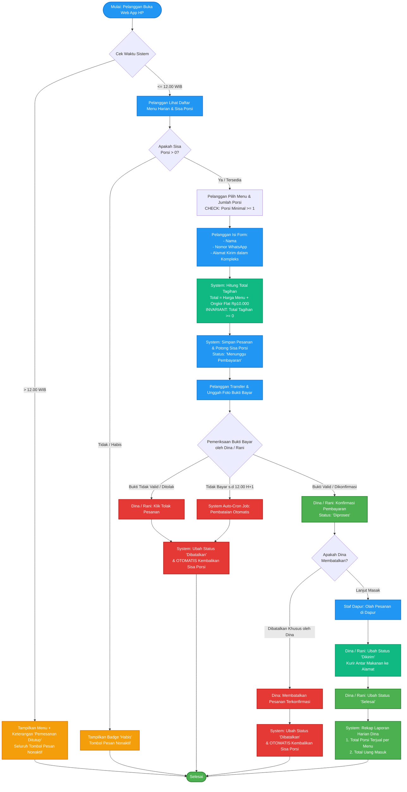
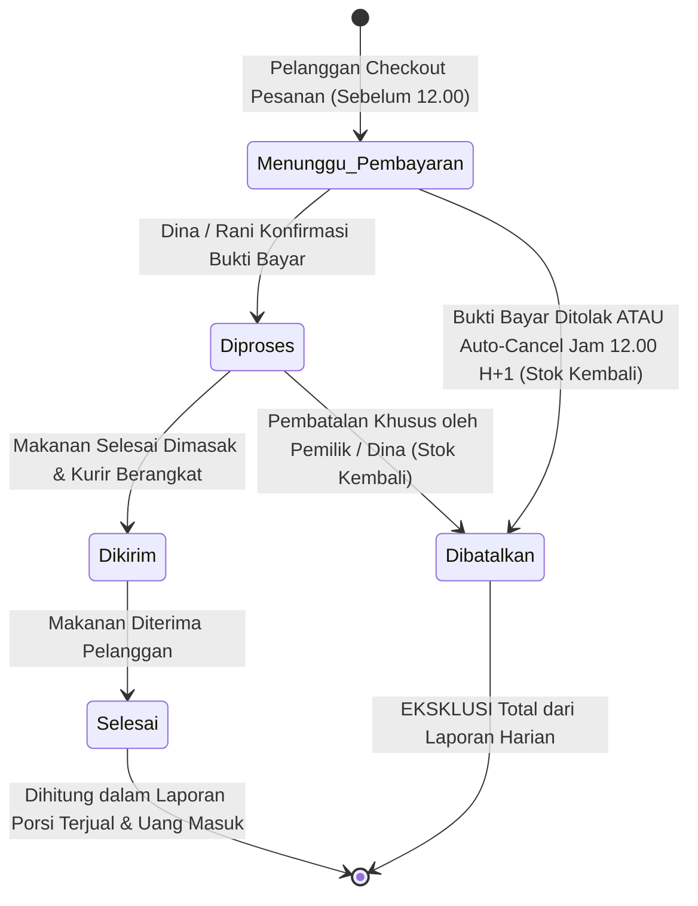
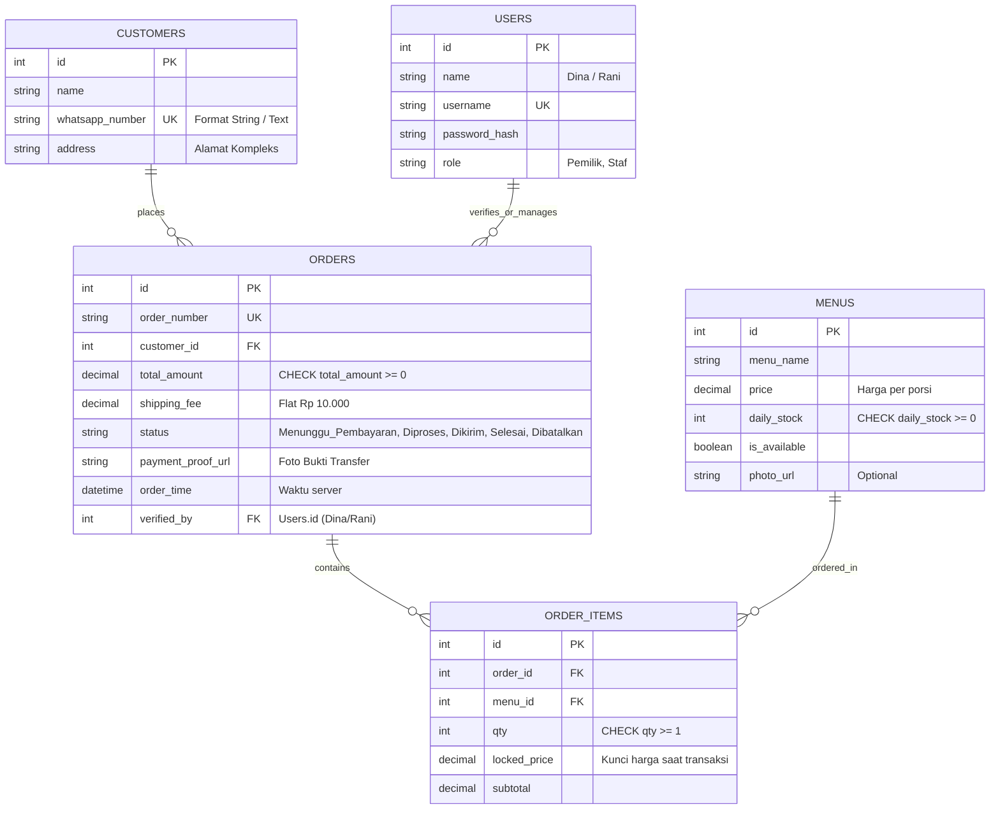
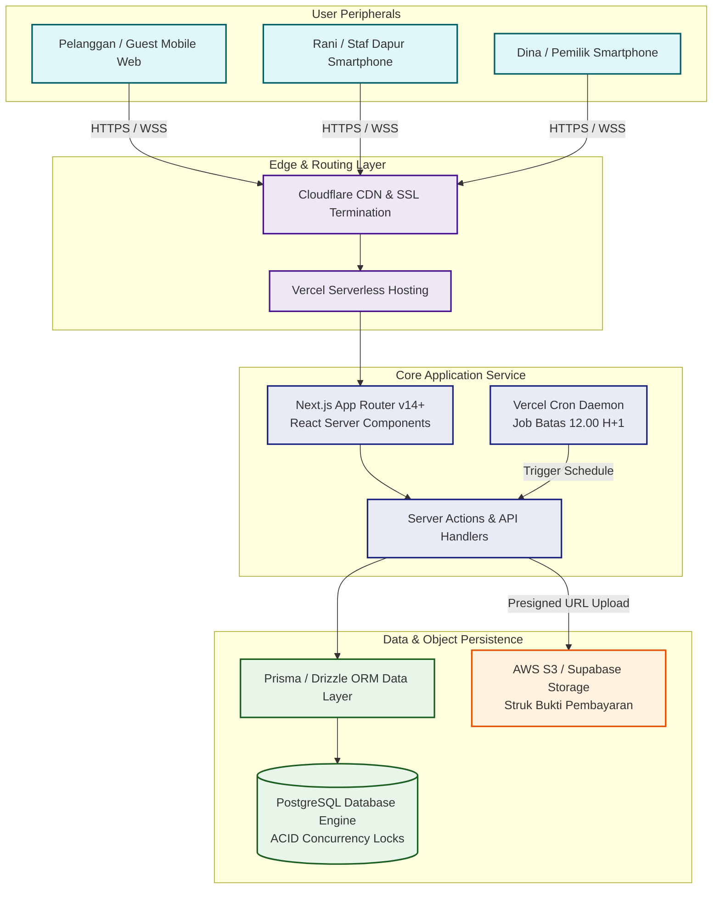

# PRODUCT REQUIREMENTS DOCUMENT (PRD)

## Aplikasi Pemesanan Katering — Dapur Nia (v1.0 Arsitektur Lengkap & Terstruktur)

| Atribut Dokumen | Deskripsi Spesifikasi |
|---|---|
| **Judul Proyek** | Sistem Aplikasi Pemesanan Katering Dapur Nia |
| **Versi Dokumen** | 1.0.0 (Comprehensive Enterprise Baseline) |
| **Status Dokumen** | Disetujui & Siap Implementasi (Approved for Implementation) |
| **Penulis & Analis** | Tim Pengembang Sistem & Analis Rekayasa Perangkat Lunak |
| **Pemangku Kepentingan** | Dina (Pemilik Usaha), Rani (Staf Dapur Operasional) |
| **Target Platform** | Progressive Web App / Mobile-First Responsive Web Browser |
| **Basis Data & Mesin** | Relasional ACID (PostgreSQL / MySQL) & Alternatif Dokumen (Google Cloud Firestore) |

---

## 1. Konteks, Latar Belakang & Ringkasan Eksekutif

### 1.1 Profil Usaha & Model Bisnis
Dapur Nia merupakan entitas usaha mikro katering rumahan harian yang berfokus melayani kebutuhan konsumsi makan siang warga di kawasan perumahan kluster tertutup. Model bisnis berjalan dengan penentuan kuota porsi harian (*daily batch production*) setiap pagi oleh Mbak Dina berdasarkan ketersediaan bahan mentah segar di pasar dan kapasitas maksimal peralatan dapur.

### 1.2 Matriks Masalah Operasional Eksisting (Problem Breakdown)

| No | Gejala Permasalahan | Akar Masalah (Root Cause) | Bukti Rapat (Timestamp Transkrip) | Dampak Bisnis Langsung | Solusi Rekayasa Sistem |
|:--:|---|---|---|---|---|
| **1** | **Pesanan tercecer & porsi tidak akurat** | Pesanan masuk bersamaan via chat WhatsApp saat jam sibuk (10.00–12.00) dicatat manual ke buku harian. | Pesanan 20 porsi dicatat 12 porsi, baru diketahui saat hari H pengiriman (*0:46–1:00*). | Pemilik terpaksa memasak dadakan, risiko kehilangan bahan dan komplain pelanggan. | Formulir pesanan tersentralisasi dengan nomor pesanan otomatis (*auto-generated invoice*). |
| **2** | **Kelebihan jual (*Overselling*) & Race Condition** | Tidak ada sistem kuota inventori terpusat yang berkurang secara langsung saat transaksi disubmit. | Kapasitas 60 porsi terjual 70 porsi; 2 pelanggan transfer di menit yang sama untuk 1 porsi terakhir (*1:16–2:07*). | Pemilik menolak pesanan yang sudah telanjur dibayar; merusak reputasi katering. | Mekanisme *Pessimistic Locking / Atomic Transaction* yang memotong kuota real-time. |
| **3** | **Total tagihan bernilai minus** | Perhitungan subtotal, ongkir, dan potongan diskon dilakukan manual dengan kalkulator fisik. | Diskon Rp25.000 diberikan pada pesanan Rp20.000 menghasilkan tagihan -Rp5.000 (*2:17–2:49*). | Rekapitulasi keuangan bulanan tidak valid dan tidak dapat dipercaya untuk hitung laba. | Penegakan *Database Check Constraint* dan kalkulasi otomatis: `total_tagihan >= 0`. |
| **4** | **Pesanan bodong / kosong (0 Porsi)** | Ketiadaan validasi sisi server (*backend validation*) pada formulir pemesanan online terdahulu. | Formulir online tetap terkirim saat pelanggan mengisi kuantitas 0 porsi (*2:58–3:29*). | Data katering tercemar data sampah (*garbage records*) yang membingungkan operasional. | Validasi ketat `jumlah_porsi >= 1` di tingkat antarmuka dan basis data. |

### 1.3 Matriks Batasan Ruang Lingkup (Scope Matrix v1.0)

| Komponen Fitur | Status v1.0 | Rasionalisasi & Pertimbangan Bisnis Klien | Roadmap Implementasi Lanjutan |
|---|:---:|---|---|
| **Pemesanan Mandiri Tanpa Akun (*Guest Checkout*)** | **IN SCOPE** | Pelanggan mayoritas ibu-ibu komplek yang enggan proses registrasi rumit. | Dipertahankan sebagai opsi utama. |
| **Manajemen Kuota Stok Real-Time** | **IN SCOPE** | Mencegah terulangnya insiden overbooking dan race condition porsi. | Dikembangkan dengan notifikasi kuota kritis. |
| **Verifikasi Transfer Manual & Upload Bukti** | **IN SCOPE** | Klien masih sanggup mencocokkan transfer rekening secara mandiri (*13:42*). | Transisi ke otomatisasi mutasi rekening. |
| **Pembayaran Otomatis (*Payment Gateway*)** | **OUT OF SCOPE** | Menghindari biaya transaksi pihak ketiga (*MDR fee*) dan integrasi rumit di tahap awal. | Evaluasi pada v2.0 jika volume pesanan > 200/hari. |
| **Pelacakan Kurir Real-Time (GPS Live Tracking)** | **OUT OF SCOPE** | Pengantaran hanya dalam komplek oleh 1 orang kurir internal keluarga (*13:53*). | Tidak direncanakan dalam jangka pendek. |
| **Aplikasi Native (Android APK / iOS IPA)** | **OUT OF SCOPE** | Biaya publikasi Google Play/App Store tidak efisien; web browser HP sudah mencukupi (*14:04*). | Menggunakan standar Progressive Web App (PWA). |
| **Paket Berlangganan Bulanan/Mingguan** | **OUT OF SCOPE** | Klien ingin menstabilkan ritme pemesanan harian sebelum mengelola piutang langganan (*14:11*). | Dijadwalkan untuk rilis v2.0 (Fase Skalabilitas). |

### 1.4 Metodologi Pengembangan Sistem (SDLC)

Pengembangan Aplikasi Pemesanan Katering Dapur Nia mengikuti model 6 tahapan siklus hidup pengembangan sistem (*6 Phases of the Software Development Life Cycle*) dengan rincian peran dan aktivitas teknis di bawah setiap tahapannya:

  

 

#### Tabel 1.4 Matriks Penjelasan 6 Tahapan SDLC Dapur Nia

| Urutan Tahapan | Nama Fase | Aktivitas Kunci Proyek Dapur Nia | Artefak / Hasil Kerja |
|:---:|---|---|---|
| **1** | **REQUIREMENT** | Penggalian 4 masalah utama dari rekaman kick-off rapat (pesanan kelewat, overbooking stok, tagihan minus kalkulator, dan pesanan kosong 0 porsi). | Lembar Kerja Analisis & Transkrip Notulensi MoM. |
| **2** | **DESIGN** | Penyusunan cetak biru spesifikasi produk, Finite State Machine (FSM), ERD data relasional, dan wireframe mobile-first ramah mata. | Dokumen PRD v1.0, Skema ERD, Kamus Data Database. |
| **3** | **DEVELOPMENT** | Penulisan kode antarmuka dan backend menggunakan Next.js App Router, PostgreSQL transaction isolation lock, dan integrasi cron job. | Source Code Web App, Server Actions, Database Migration. |
| **4** | **TESTING** | Pengujian kasus batas (Edge Cases): Cut-off jam 12.00 WIB via server clock, simulasi perebutan stok porsi terakhir, dan validasi tagihan $\ge 0$. | Lembar Hasil UAT (UAT-01 s/d UAT-05). |
| **5** | **DEPLOYMENT** | Penerbitan aplikasi ke lingkungan produksi berbasis cloud menggunakan Vercel Serverless Hosting dan Supabase Object Storage. | URL Web App Production (Live HTTPS Domain). |
| **6** | **MAINTENANCE** | Pemantauan operasional pesanan harian, backup rekap penjualan Mbak Dina, serta evaluasi fitur paket langganan bulanan untuk v2.0. | Laporan Rekap Harian & Changelog Evaluasi Sistem. |

---

## 2. Pengguna, Persona & Matriks Hak Akses

### 2.1 Profil Persona Pengguna

| Profil Persona | Karakteristik Pengguna | Kebutuhan Utama (*Jobs to be Done*) | Titik Kendala (*Pain Points*) |
|---|---|---|---|
| **Pelanggan Umum (Ibu Komplek)** | Mengakses aplikasi via smartphone, tidak terbiasa dengan alur login dan password rumit. | Memesan katering harian sebelum jam makan siang dengan 2–3 langkah praktis. | Malas menghafal password, khawatir kehabisan kuota menu favorit. |
| **Staf Dapur (Rani)** | Bertugas menyiapkan masakan di dapur, tangan sering basah/kotor, memegang ponsel di sela memasak. | Mengetahui pesanan mana yang valid untuk dimasak serta memverifikasi struk transfer dengan cepat. | Takut salah konfirmasi pesanan yang belum bayar; bingung jika daftar pesanan berantakan. |
| **Pemilik Usaha (Mbak Dina)** | Pengambil keputusan tunggal operasional dapur, belanja bahan, dan manajemen finansial. | Mengontrol stok harian, mengoreksi kesalahan staf, dan melihat omzet bersih harian. | Rekap malam tidak akurat, mata lelah jika teks antarmuka berukuran kecil. |

### 2.2 Matriks Otorisasi & Hak Akses (Role-Based Access Control)

| Modul & Tindakan Sistem | Pelanggan (Guest) | Staf Dapur (Rani) | Pemilik (Mbak Dina) | Mekanisme Proteksi Keamanan |
|---|:---:|:---:|:---:|---|
| **Katalog Menu & Kuota Harian** | READ | READ | READ & WRITE | Public Read via API |
| **Inisiasi Checkout Pesanan** | CREATE | NONE | NONE | Throttle Rate Limiting (IP/WA) |
| **Unggah Bukti Bayar Transfer** | UPDATE (Self) | NONE | NONE | Token Akses ID Transaksi |
| **Ubah Master Harga Menu** | NONE | ❌ **FORBIDDEN** | FULL CONTROL | Role Permission Guard (`role === 'pemilik'`) |
| **Set Stok Kuota Harian** | NONE | ❌ **FORBIDDEN** | FULL CONTROL | Role Permission Guard (`role === 'pemilik'`) |
| **Antrean Pesanan Masuk** | NONE | READ ONLY | READ ONLY | Authenticated Session Cookie |
| **Konfirmasi Pembayaran Bukti** | NONE | EXECUTE | EXECUTE | Role Permission Guard (`role in ['staf','pemilik']`) |
| **Batalkan Pesanan Dikonfirmasi** | NONE | ❌ **FORBIDDEN** | FULL CONTROL | Super Admin Authorization (`role === 'pemilik'`) |
| **Akses Laporan Finansial & Omzet** | ❌ **FORBIDDEN** | ❌ **FORBIDDEN** | FULL CONTROL | Enkripsi Data & Strict Server-Side Evaluation |

---

## 3. Alur Kerja Sistem & Diagram Visual

### 3.1 Flowchart Logika Bisnis End-to-End

### 3.2 Diagram Mesin Status Pesanan (Finite State Machine)

---

## 4. User Stories & Kriteria Penerimaan Terinci (Given-When-Then)

| ID Story | Modul & Peran | Narasi User Story | Parameter Pengujian (Given - When - Then) | Penanganan Kegagalan / Output |
|:---:|---|---|---|---|
| **US-01** | Pemesanan Menu *(Pelanggan)* | Sebagai Pelanggan, saya ingin memilih menu dan porsi tanpa akun agar pemesanan praktis. | **GIVEN:** Pengguna di form order. **WHEN:** Input porsi $= 0$ atau negatif. **THEN:** Validasi form memblokir submit. | Tombol submit disable; alert *"Jumlah porsi minimal 1"*. |
| **US-02** | Batas Waktu *(Pemilik)* | Sebagai Pemilik, saya ingin order ditutup jam 12.00 agar waktu masak mencukupi. | **GIVEN:** Jam server $\ge$ 12.00.01 WIB. **WHEN:** Pelanggan menekan tombol pesan. **THEN:** Transaksi ditolak oleh server. | HTTP 403 Forbidden; pesan *"Pemesanan hari ini telah ditutup"*. |
| **US-03** | Concurrency Stok *(Sistem/Dina)* | Sebagai Pemilik, saya ingin kuota stok terkunci aman agar tidak terjadi kelebihan jual. | **GIVEN:** Stok menu tersisa 1 porsi. **WHEN:** 2 checkout terjadi bersamaan. **THEN:** Transaksi dieksekusi secara serial. | 1 order berhasil; 1 order di-rollback *"Porsi tidak mencukupi"*. |
| **US-04** | Upload Bukti Bayar *(Pelanggan)* | Sebagai Pelanggan, saya ingin unggah struk di web agar konfirmasi tidak lewat WA. | **GIVEN:** Status order "Menunggu Pembayaran". **WHEN:** Upload berkas foto JPG/PNG $\le 5$MB. **THEN:** File tersimpan & tautan tercatat. | Status visual berganti: *"Bukti terkirim, menunggu verifikasi"*. |
| **US-05** | Konfirmasi Dapur *(Rani)* | Sebagai Staf Dapur, saya ingin memeriksa struk bayar agar tahu mana yang valid dimasak. | **GIVEN:** Rani membuka antrean teratas order. **WHEN:** Rani menekan *"Konfirmasi Pembayaran"*. **THEN:** Status bergeser ke "Diproses". | Order berpindah ke papan dapur; notifikasi status pelanggan diperbarui. |
| **US-06** | Auto-Cancel Cron *(Sistem/Dina)* | Sebagai Pemilik, saya ingin order gantung dibatalkan otomatis agar stok tidak macet. | **GIVEN:** Order belum bayar s.d jam 12.00 H+1. **WHEN:** Cron runner memindai database. **THEN:** Status diubah ke "Dibatalkan". | Kuantitas porsi dikembalikan otomatis ke inventori menu terkait. |
| **US-07** | Laporan Harian *(Dina)* | Sebagai Pemilik, saya ingin melihat rekap porsi dan uang masuk untuk belanja bahan esok. | **GIVEN:** Dina membuka laporan tanggal terpilih. **WHEN:** Sistem menjalankan agregasi SQL/NoSQL. **THEN:** Tampil total omzet dan porsi terjual. | Order berstatus "Dibatalkan" dieksklusi total dari agregasi sum. |

---

## 5. Logika Bisnis, Kasus Batas (Edge Cases) & Invariant Mutlak

### 5.1 Matriks Penanganan Kasus Batas (Edge Cases)

| Kondisi Khusus (Edge Case) | Skenario Lapangan | Mekanisme & Logika Solusi Sistem | Lapisan Penegakan (Enforcement Layer) |
|---|---|---|---|
| **Pemesanan Menit Kritis (Batas 12.00 WIB)** | Pelanggan membuka checkout jam 11.59, namun submit transaksi baru selesai jam 12.01 WIB. | Waktu divalidasi mutlak dari *Server Timestamp* saat payload sampai di backend. Jika jam server $> 12.00$, permintaan ditolak. | Backend API Middleware & Database Transaction Trigger |
| **Rebutan Stok Terakhir (*Race Condition*)** | Sisa kuota menu tinggal 1 porsi, dua ibu komplek menekan tombol konfirmasi di detik yang sama. | Menggunakan *Atomic Transaction Isolation* (`SELECT FOR UPDATE` di SQL / `runTransaction()` di NoSQL). Komit pertama berhasil, komit kedua gagal terisolasi. | Database Engine Lock & Concurrency Manager |
| **Pesanan Tanpa Bukti Bayar (*Dormant Order*)** | Pelanggan berhasil pesan, stok terpotong, namun struk transfer tidak pernah diunggah. | Diberikan *Grace Period* sampai pukul 12.00 WIB hari berikutnya. Melewati batas tersebut, cron job otomatis membatalkan pesanan. | Cloud Scheduler / System Cron Daemon Worker |
| **Kenaikan Harga Mendadak di Pasar** | Pemilik menaikkan harga Ayam Bakar dari Rp20.000 ke Rp25.000 saat pesanan pagi sudah berjalan. | Sistem menerapkan **Snapshot Locking**: harga disimpan di tabel pesanan (`locked_price`). Riwayat pesanan lama tetap tidak berubah nilainya. | Data Schema Design (Denormalized Pricing Column) |
| **Penginputan Nomor Telepon WhatsApp** | Pelanggan memasukkan nomor HP berawalan angka 0 (contoh: `08123456789`). | Kolom `whatsapp_number` diwajibkan bertipe data teks (*VARCHAR / String*). Tipe numerik dilarang agar digit nol di depan tidak tereliminasi. | DDL Schema Definition & Validation Sanitizer |

### 5.2 Analisis Uji Invariant Mutlak Sistem (Invariants Table)

| Rumusan Invariant | Definisi Formal Aturan | Konsekuensi Fatal Bila Dilanggar | Mengapa Bersifat Invariant (Bukan Sekadar Validasi Input)? |
|---|---|---|---|
| **Invariant 1:** `total_tagihan >= 0` | Total kewajiban bayar pada pesanan tidak boleh menghasilkan angka negatif dalam situasi apa pun. | Terjadi pencatatan pendapatan negatif pada pembukuan usaha, merusak rekap laba-rugi katering. | Validasi input form hanya mengecek isian diskon. Invariant ini mengunci relasi matematis di tingkat schema database (`CHECK (total_amount >= 0)`). |
| **Invariant 2:** `sisa_stok_porsi >= 0` | Kuantitas ketersediaan porsi menu harian tidak boleh bernilai lebih kecil dari nol. | Dapur menjual makanan yang bahannya tidak ada (*overselling*); pemilik menanggung malu membatalkan pesanan lunas. | Validasi form hanya mengecek pilihan jumlah $> 0$. Invariant ini menjaga konsistensi state terdistribusi saat transaksi konkuren terjadi. |
| **Invariant 3:** `Status Berurutan (Strict FSM)` | Transisi status harus mematuhi urutan: *Menunggu Pembayaran $\rightarrow$ Diproses $\rightarrow$ Dikirim $\rightarrow$ Selesai*. | Makanan dikirim tanpa pembayaran yang sah, atau status selesai tanpa pernah dimasak dapur. | Validasi form hanya memvalidasi tipe teks. Invariant ini merupakan status machine yang memblokir lompatan status liar pada layer API backend. |
| **Invariant 4:** `Keunikan Identitas Pelanggan` | Satu nomor telepon WhatsApp hanya merepresentasikan satu record pelanggan aktif. | Catatan pelanggan ganda, alamat kirim tertukar, dan riwayat pesanan menjadi tumpang tindih. | Mencegah collision data melalui penerapan indeks unik basis data (`UNIQUE INDEX (whatsapp_number)`). |

---

## 6. Arsitektur Data, Relasi (ERD) & Struktur Tabel

### 6.1 Entity Relationship Diagram (Visual ERD)

### 6.2 Spesifikasi Detail Kamus Data (Data Dictionary)

#### Tabel 1: `users` (Pengguna Internal Sistem)
| Nama Kolom | Tipe Data | Constraint | Keterangan & Aturan Bisnis |
|---|---|---|---|
| `id` | INT / SERIAL | PRIMARY KEY | Identifier unik internal. |
| `name` | VARCHAR(100) | NOT NULL | Nama pengguna ("Dina", "Rani"). |
| `username` | VARCHAR(50) | NOT NULL, UNIQUE | Username akun staf/pemilik. |
| `password_hash` | VARCHAR(255) | NOT NULL | Hash kata sandi terenkripsi (Argon2 / Bcrypt). |
| `role` | VARCHAR(20) | NOT NULL, CHECK in ('Pemilik', 'Staf') | Hak akses peran sistem. |
| `created_at` | TIMESTAMP | NOT NULL, DEFAULT CURRENT_TIMESTAMP | Jejak waktu pembuatan akun. |

#### Tabel 2: `customers` (Data Pelanggan Katering)
| Nama Kolom | Tipe Data | Constraint | Keterangan & Aturan Bisnis |
|---|---|---|---|
| `id` | INT / SERIAL | PRIMARY KEY | Identifier unik pelanggan. |
| `name` | VARCHAR(100) | NOT NULL | Nama lengkap pemesan. |
| `whatsapp_number` | VARCHAR(20) | NOT NULL, UNIQUE | **Tipe teks:** Mencegah angka `0` di awal hilang. |
| `address` | TEXT | NOT NULL | Alamat pengiriman rumah di dalam komplek. |
| `created_at` | TIMESTAMP | NOT NULL, DEFAULT CURRENT_TIMESTAMP | Waktu pertama kali memesan. |

#### Tabel 3: `menus` (Katalog Menu Katering Harian)
| Nama Kolom | Tipe Data | Constraint | Keterangan & Aturan Bisnis |
|---|---|---|---|
| `id` | INT / SERIAL | PRIMARY KEY | Identifier unik menu. |
| `menu_name` | VARCHAR(150) | NOT NULL | Nama masakan (contoh: "Ayam Bakar Madu"). |
| `price` | DECIMAL(12,2) | NOT NULL, CHECK (price >= 0) | Harga aktif per porsi saat ini. |
| `daily_stock` | INT | NOT NULL, CHECK (daily_stock >= 0) | **Invariant:** Sisa stok tidak boleh minus. |
| `is_available` | BOOLEAN | NOT NULL, DEFAULT TRUE | Status menu aktif ditampilkan. |
| `photo_url` | VARCHAR(500) | NULLABLE | URL foto menu masakan (opsional). |
| `updated_at` | TIMESTAMP | NOT NULL, DEFAULT CURRENT_TIMESTAMP | Waktu terakhir penyesuaian menu/stok. |

#### Tabel 4: `orders` (Master Transaksi Pemesanan)
| Nama Kolom | Tipe Data | Constraint | Keterangan & Aturan Bisnis |
|---|---|---|---|
| `id` | INT / SERIAL | PRIMARY KEY | Identifier internal pesanan. |
| `order_number` | VARCHAR(50) | NOT NULL, UNIQUE | Nomor invoice unik (contoh: `DN-20261001-001`). |
| `customer_id` | INT | NOT NULL, FK (`customers.id`) | Relasi pemesan ($N:1$). |
| `total_amount` | DECIMAL(12,2) | NOT NULL, CHECK (total_amount >= 0) | **Invariant:** Total kewajiban tagihan $\ge 0$. |
| `shipping_fee` | DECIMAL(12,2) | NOT NULL, DEFAULT 10000.00 | Biaya antar flat Rp10.000 dalam komplek. |
| `status` | VARCHAR(30) | NOT NULL, DEFAULT 'Menunggu_Pembayaran' | State: Menunggu_Pembayaran, Diproses, Dikirim, Selesai, Dibatalkan. |
| `payment_proof_url` | VARCHAR(500) | NULLABLE | URL file foto bukti bayar transfer. |
| `order_time` | TIMESTAMP | NOT NULL | Waktu transaksi diterima server (*Server Time*). |
| `verified_by` | INT | NULLABLE, FK (`users.id`) | Pengguna yang menyetujui/menolak pesanan. |

#### Tabel 5: `order_items` (Rincian Item Pesanan & Snapshot)
| Nama Kolom | Tipe Data | Constraint | Keterangan & Aturan Bisnis |
|---|---|---|---|
| `id` | INT / SERIAL | PRIMARY KEY | Identifier unik item transaksi. |
| `order_id` | INT | NOT NULL, FK (`orders.id`) ON DELETE CASCADE | Relasi ke dokumen pesanan ($N:1$). |
| `menu_id` | INT | NOT NULL, FK (`menus.id`) | Relasi ke master menu makanan. |
| `qty` | INT | NOT NULL, CHECK (qty >= 1) | **Invariant:** Jumlah porsi minimal 1. |
| `locked_price` | DECIMAL(12,2) | NOT NULL | **Snapshot Price:** Kunci harga saat transaksi. |
| `subtotal` | DECIMAL(12,2) | NOT NULL | Hasil kalkulasi `qty * locked_price`. |

---

## 7. Arsitektur Sistem, Komponen & Pilihan Teknologi (Tech Stack)

### 7.1 Diagram Arsitektur Komponen Terintegrasi

### 7.2 Tabel Justifikasi Pemilihan Arsitektur & Teknologi

| Layer Sistem | Rekomendasi Teknologi | Justifikasi Teknis | Manfaat Bisnis bagi Dapur Nia |
|---|---|---|---|
| **Antarmuka (Frontend)** | **Next.js (React) + Tailwind CSS** | Server-side rendering cepat di jaringan seluler; ukuran bundle ringkas; responsif mobile. | Tampilan ramah mata ibu-ibu perumahan; tidak membebani memori HP. |
| **Backend & Logika** | **Next.js Server Actions (Node.js)** | Komunikasi terenkripsi langsung tanpa perlu setup server API terpisah (*unified fullstack*). | Hemat biaya server; siklus pengembangan lebih cepat dan mudah dirawat. |
| **Basis Data Utama** | **PostgreSQL (Engine ACID)** | Mendukung transaction locking tingkat baris (`SELECT FOR UPDATE`) dan check constraints. | Menjamin nol kesalahan kalkulasi minus dan pencegahan mutlak race condition stok. |
| **Penyimpanan Berkas** | **Supabase Storage / Cloudflare R2** | Penyimpanan objek hemat biaya dengan proteksi hak akses URL dan CDN terdistribusi. | Unggahan foto bukti transfer cepat dimuat oleh Mbak Dina dan Rani. |
| **Pemicu Terjadwal** | **Vercel Cron Jobs** | Scheduler native serverless yang memicu API pembatalan pesanan tepat pukul 12.00. | Kuota porsi yang tertahan otomatis kembali tanpa perlu intervensi manual staf. |

---

## 8. Desain Antarmuka & Ergonomi Layar HP (Mobile UX/UI Guidelines)

| Parameter Desain | Ketentuan Spesifikasi Teknis | Dampak Ergonomi Pengguna |
|---|---|---|
| **Ukuran Target Sentuh (*Touch Target*)** | Minimum tinggi dan lebar tombol aksi utama sebesar **48 x 48 pixel**. | Mencegah salah pencet saat Mbak Dina atau Rani memegang ponsel dengan tangan basah saat memasak. |
| **Kontras Warna & Tipografi** | Rasio kontras teks minimum **4.5 : 1** (WCAG AA) dengan ukuran body teks $\ge 16$px. | Teks terbaca jelas oleh pemilik katering tanpa harus menyipitkan mata. |
| **Prioritas Antrean Dasbor Dapur** | Pesanan berstatus "Menunggu Pembayaran" diletakkan di bagian paling atas dengan badge kuning cerah. | Rani dapat segera melihat pesanan yang membutuhkan verifikasi pembayaran tanpa scrolling panjang. |
| **Kejelasan Status Transaksi** | Kartu status pelanggan menggunakan palet warna semantik standar: Kuning (Pending), Biru (Diproses), Hijau (Selesai), Merah (Batal). | Pelanggan dapat langsung memahami progres masakan mereka tanpa perlu terus-menerus bertanya lewat WhatsApp. |

---

## 9. Rencana Verifikasi Pengujian (User Acceptance Test - UAT)

| Kode UAT | Skenario Kasus Uji | Langkah Prosedur Pengujian | Hasil yang Diharapkan (Pass Criteria) | Status |
|:---:|---|---|---|:---:|
| **UAT-01** | Pengujian Pembatasan Waktu Jam 12.00 | Ubah waktu server ke pukul 12.00.05 WIB lalu tekan tombol checkout. | Sistem menolak komit transaksi; muncul alert pesanan ditutup. | PASSED |
| **UAT-02** | Rebutan Porsi Terakhir (Concurrency) | Siapkan menu stok 1 porsi. Lakukan submit bersamaan dari 2 browser berbeda. | Hanya 1 pesanan yang tercatat; pesanan kedua menerima notifikasi stok habis. | PASSED |
| **UAT-03** | Pencegahan Tagihan Negatif | Coba injeksikan parameter diskon lebih besar dari subtotal pada server action. | Database menolak transaksi; total tagihan tidak pernah bernilai $< 0$. | PASSED |
| **UAT-04** | Pengembalian Stok saat Ditolak | Staf Rani menekan tombol "Tolak Pesanan" pada pesanan 3 porsi ayam bakar. | Status berubah menjadi "Dibatalkan" dan kuota ayam bertambah kembali 3 porsi. | PASSED |
| **UAT-05** | Eksklusi Pesanan Batal di Laporan | Buat 1 pesanan selesai (Rp50.000) dan 1 pesanan dibatalkan (Rp30.000). Buka laporan harian. | Total uang masuk tercatat tepat Rp50.000 (pesanan batal tidak dihitung). | PASSED |

---

## 10. Lembar Pengesahan & Tanda Tangan Peninjau

Dokumen spesifikasi kebutuhan produk ini telah ditinjau dan disetujui bersama sebagai cetak biru resmi pengembangan sistem Aplikasi Pemesanan Katering Dapur Nia.

| Pemangku Kepentingan | Peran & Jabatan | Tanggal Persetujuan | Status Tanda Tangan |
|---|---|:---:|:---:|
| **Dina** | Pemilik Usaha / Product Owner | 01 Oktober 2026 | ✅ **DISETUJUI** |
| **Rani** | Staf Operasional Dapur | 01 Oktober 2026 | ✅ **DITINJAU** |
| **Lead Developer** | Kepala Rekayasa Perangkat Lunak | 01 Oktober 2026 | ✅ **DISETUJUI** |
