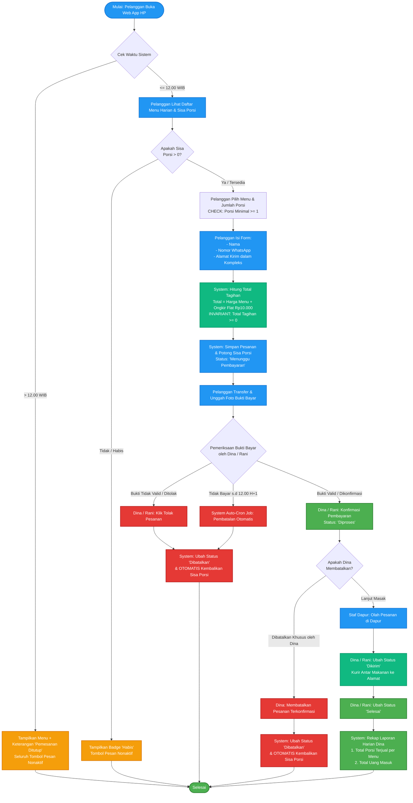
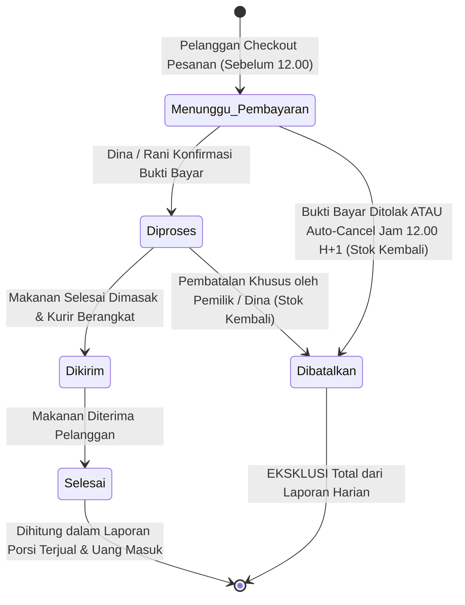
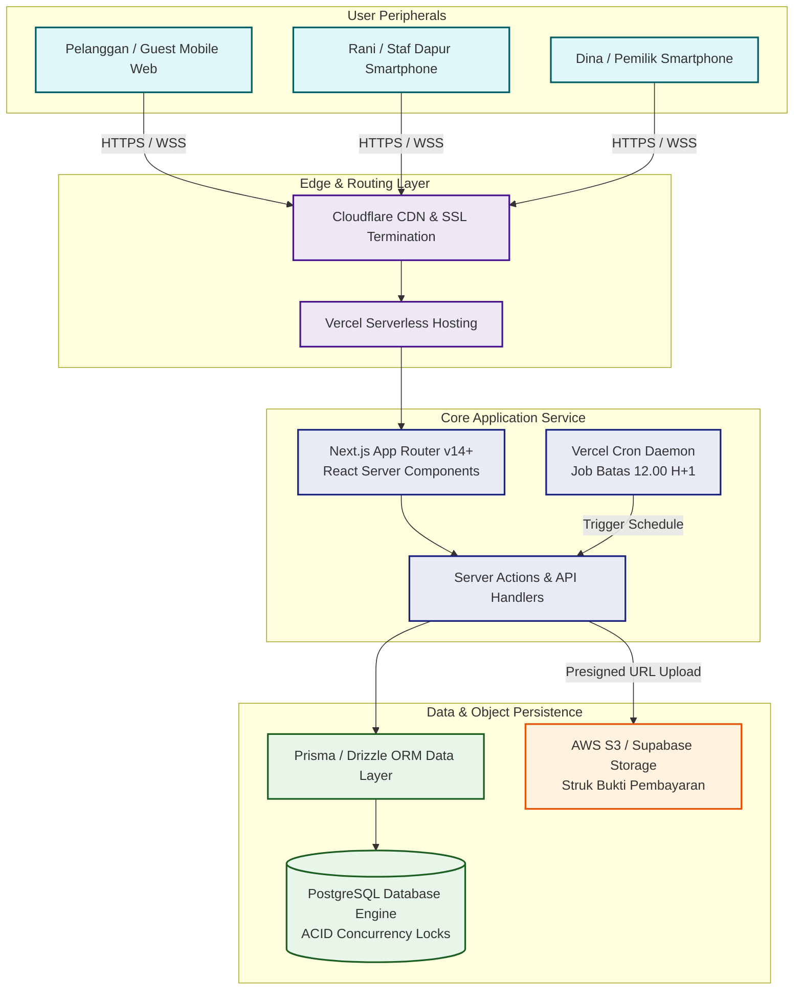
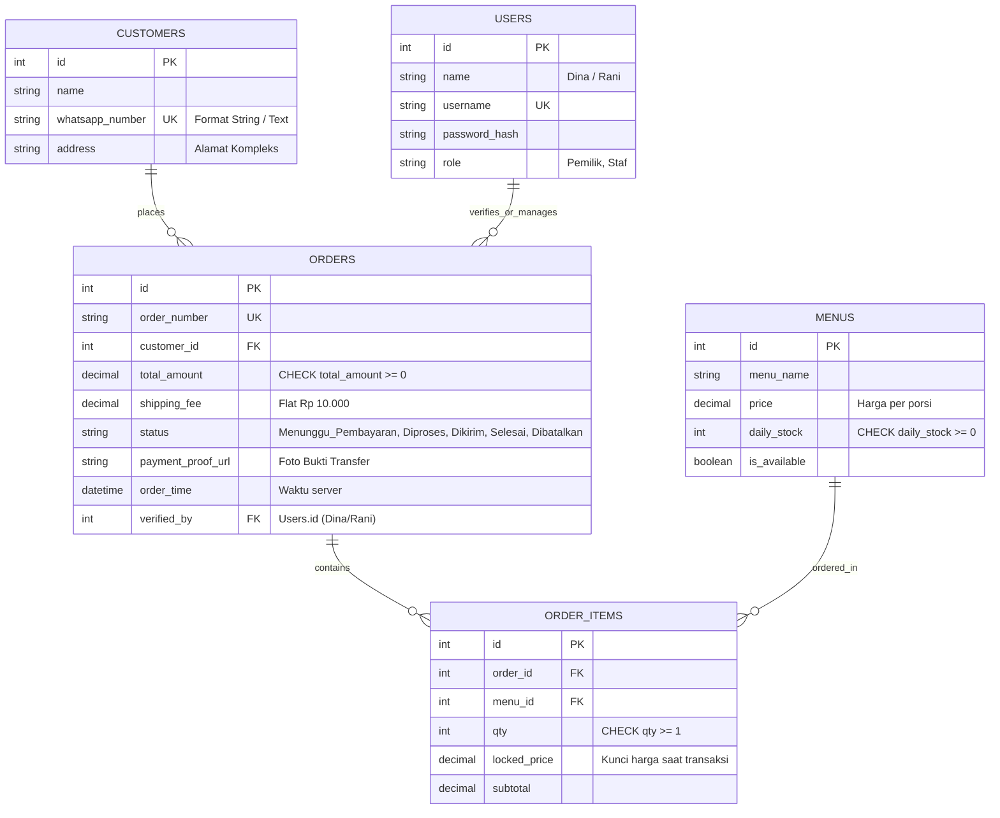

# Product Requirements Document

## Identitas Dokumen

| Keterangan | Isian |
|---|---|
| Nama aplikasi | Aplikasi Pemesanan Katering Dapur Nia |
| Tanggal | 01 Oktober 2026 |
| Status | Draf untuk diskusi — v1.0 |
| Sumber | Transkrip-Meeting-Dapur-Nia, Catatan Rapat Aplikasi Pemesanan Katering Dapur Nia |

## Daftar Isi
1. Ringkasan Eksekutif
2. Pengguna dan Peran
3. Lingkup Produk
4. Kebutuhan Fungsional
5. Identitas Visual dan Prinsip Antarmuka
6. Kebutuhan Non-Fungsional
7. Teknologi yang Digunakan
8. Pengujian
9. Batas Lingkup Pekerjaan
10. Kamus Istilah

---

## 1. Ringkasan Eksekutif

Dapur Nia adalah usaha katering rumahan harian yang melayani kebutuhan konsumsi makan siang warga di perumahan kluster. Saat ini pencatatan pesanan lewat pesan WhatsApp sering tercecer, sisa porsi tidak akurat yang berujung kelebihan jual (*overselling*), dan hitungan kalkulator manual terkadang menghasilkan tagihan negatif saat ada diskon. Aplikasi ini dibangun untuk mensentralisasi pesanan agar proses rekap, kuota, dan tagihan berjalan sistematis tanpa intervensi manual yang rentan salah.

Aplikasi ini akan digunakan oleh pelanggan (warga perumahan), staf dapur, dan pemilik usaha, namun tidak diperuntukkan bagi kurir pengantar.

**Yang membuat aplikasi ini pas untuk Dapur Nia:**
*   **Pemesanan tersentralisasi dengan nomor otomatis**, mencegah pesanan tercecer yang berakibat pemilik harus memasak dadakan.
*   **Penguncian kuota stok secara langsung**, mencegah dua orang membeli porsi terakhir secara bersamaan (*race condition*) dan menjaga reputasi katering.
*   **Kalkulasi otomatis & validasi sistem**, mencegah total tagihan bernilai minus sehingga laporan omzet harian selalu valid.
*   **Validasi formulir yang ketat**, menolak pesanan berisi nol porsi sehingga data tidak kotor.

Yang tidak dibangun di v1: Pembayaran otomatis (payment gateway), pelacakan posisi kurir, aplikasi native toko aplikasi, dan program langganan bulanan (Detail di Bab 9).

### 1.1 Metodologi Pengembangan Sistem (SDLC)
Pengembangan aplikasi ini mengikuti model 6 tahapan siklus hidup pengembangan sistem:

<div align="center">
  
</div>
<br/>

| Urutan Tahapan | Nama Fase | Aktivitas Kunci Proyek Dapur Nia |
|:---:|---|---|
| **1** | **REQUIREMENT** | Penggalian 4 masalah utama dari rekaman kick-off rapat (pesanan kelewat, overbooking stok, tagihan minus, pesanan 0 porsi). |
| **2** | **DESIGN** | Penyusunan cetak biru spesifikasi produk, Finite State Machine (FSM), ERD data relasional, dan wireframe mobile. |
| **3** | **DEVELOPMENT** | Penulisan kode antarmuka dan backend menggunakan Next.js App Router, PostgreSQL transaction lock, dan cron job. |
| **4** | **TESTING** | Pengujian kasus batas (Edge Cases): Cut-off jam 12.00 WIB, simulasi rebutan stok porsi terakhir, dan validasi tagihan $\ge 0$. |
| **5** | **DEPLOYMENT** | Penerbitan aplikasi ke lingkungan produksi berbasis cloud menggunakan Vercel Serverless Hosting dan Supabase Storage. |
| **6** | **MAINTENANCE** | Pemantauan operasional pesanan harian, backup rekap penjualan Mbak Dina, serta evaluasi fitur paket langganan. |

---

## 2. Pengguna dan Peran

Terdapat tiga peran pengguna dalam aplikasi, yaitu pemilik (pengelola utama), staf dapur (hanya operasional), dan pelanggan (pemesan).

| Peran | Siapa | Tugas utama | Modul yang dibuka |
|---|---|---|---|
| Pemilik | Dina (Pengambil keputusan) | Memastikan stok, konfirmasi pesanan, & cek laporan harian | Katalog Menu, Antrean Pesanan, Laporan Harian |
| Staf | Rani (Juru masak) | Mengecek pesanan baru dan validasi bukti bayar | Antrean Pesanan |
| Pelanggan | Ibu-ibu warga perumahan | Memesan katering dan unggah bukti transfer | Katalog Menu (Guest Checkout) |

**Ringkasan hak akses di dalam Modul Antrean Pesanan**

| Bagian | Pemilik | Staf | Pelanggan |
|---|---|---|---|
| Daftar Pesanan Masuk | Lihat dan kelola | Lihat dan kelola | Tidak tampil |
| Tombol Konfirmasi Bayar | Bisa ditekan | Bisa ditekan | Tidak tampil |
| Tombol Tolak/Batal Pesanan | Bisa ditekan | Bisa ditekan (hanya menolak) | Tidak tampil |
| Laporan Harian Omzet | Lihat | Tidak tampil | Tidak tampil |

Catatan: Pembatalan pesanan yang **sudah dikonfirmasi** hanya dapat dilakukan oleh Pemilik (Dina).

---

## 3. Lingkup Produk

Aplikasi berbentuk Progressive Web App (PWA) yang dapat dibuka langsung melalui peramban (browser) di handphone tanpa perlu diunduh dari toko aplikasi.

**3.1 Peta modul**
```text
[Katalog Menu]
[Form Checkout]
[Dasbor Admin]
  [Antrean Pesanan]
  [Laporan Harian]
```

**3.2 Batas fitur v1**

| Termasuk v1 | Tidak termasuk v1 |
|---|---|
| Pemesanan mandiri tanpa akun (guest checkout) | Pembayaran daring otomatis (payment gateway) |
| Manajemen kuota stok real-time (lock) | Pelacakan kurir real-time (GPS tracker) |
| Verifikasi transfer manual & upload bukti | Aplikasi native untuk Android/iOS |
| Dasbor dapur dan rekap penjualan harian | Paket berlangganan bulanan/mingguan |

---

## 4. Kebutuhan Fungsional

### 4.0 Diagram Alur Kerja & Mesin Status (Flowchart)

**Flowchart Logika Bisnis End-to-End**


**Diagram Mesin Status Pesanan (FSM)**


### 4.1 Ringkasan Modul

| Modul | Menu | Tujuan |
|---|---|---|
| Katalog Menu | Menu Harian | Pelanggan melihat sisa porsi dan memilih menu |
| Form Checkout | Pesanan Baru | Pelanggan mengisi identitas dan mengunggah bukti bayar |
| Dasbor Admin | Antrean & Laporan | Dapur memverifikasi bayaran dan pemilik mengecek omzet |

### 4.2 Katalog Menu & Form Checkout

Satu halaman utama yang langsung menampilkan menu harian dan form pemesanan yang responsif di layar HP.
**Tujuan**
Pelanggan dapat melakukan pemesanan makanan, melihat total harga, dan melampirkan bukti transfer.
**Hak akses**
Dapat dilihat oleh semua orang (publik/guest), staf, dan pemilik.
**Tampilan**
*   Daftar menu beserta sisa porsi harian dan harganya (posisi atas).
*   Form input Nama, Nomor WhatsApp, dan Alamat (posisi tengah).
*   Ringkasan tagihan dan tombol "Checkout & Unggah Bukti" (posisi bawah).
**Langkah Pelanggan melakukan pesanan**
1. Mengisi jumlah porsi pada menu yang diinginkan dan melengkapi form data diri.
2. Sistem menghitung total (harga + ongkos kirim) dan memotong stok sementara.
3. Pelanggan mentransfer uang dan mengunggah foto bukti bayar.
**User story**
*   Sebagai Pelanggan, saya ingin memilih menu dan porsi tanpa akun, sehingga pemesanan praktis.
*   Sebagai Pemilik, saya ingin order ditutup otomatis pukul 12.00, sehingga waktu masak di dapur mencukupi.
**Acceptance criteria**
1. Given pengguna di form order, When pelanggan mengisi 0 porsi, Then tombol submit disabled dan muncul peringatan.
2. Given stok menu tersisa 1 porsi, When 2 pelanggan checkout bersamaan, Then 1 order sukses dan 1 order ditolak ("stok habis").
3. Given jam server 12.01 WIB, When pelanggan menekan tombol pesan, Then transaksi ditolak dengan pesan "Pemesanan ditutup".
**Validasi**
*   Jumlah porsi wajib diisi minimal 1 (Pesanan berisi nol porsi tidak dapat dikirim).
*   Nomor WhatsApp hanya berisi format angka, disimpan sebagai teks agar angka nol di awal tidak hilang.
*   Pesan peringatan jika aturan dilanggar: "Mohon isi minimal 1 porsi" atau "Nomor WhatsApp tidak valid".
**Perilaku otomatis**
*   Harga pesanan dihitung otomatis: Total = (Harga menu × porsi) + Ongkos kirim Rp10.000.
*   Pemesanan ditutup otomatis pada pukul 12.00 siang berdasarkan jam peladen (server).
*   Batas unggah bukti bayar pukul 12.00 hari berikutnya, lewat dari itu otomatis dibatalkan.
**Batasan**
Tidak ada fitur kalkulasi dinamis untuk ongkos kirim berdasarkan jarak tempuh (ongkir *flat*).

### 4.3 Dasbor Admin (Antrean & Laporan)

Dasbor tertutup yang menampilkan antrean pesanan harian serta rekapitulasi data penjualan.
**Tujuan**
Memungkinkan dapur mengecek bukti bayar dan memasak, serta pemilik merekap omzet harian.
**Hak akses**
Hanya dapat diakses oleh Pemilik dan Staf. Laporan harian hanya dapat dilihat Pemilik.
**Tampilan**
*   Kartu pesanan masuk dengan label status (posisi berjejer ke bawah).
*   Tombol "Konfirmasi" dan "Tolak" pada tiap kartu pesanan (di dalam kartu).
*   Tabel rekapitulasi omzet dan porsi terjual (pada tab Laporan Harian).
**Langkah Staf melakukan konfirmasi**
1. Menekan kartu pesanan yang berstatus "Menunggu Pembayaran".
2. Sistem menampilkan foto bukti bayar yang diunggah pelanggan.
3. Staf menekan tombol "Konfirmasi" dan status berubah menjadi "Diproses".
**User story**
*   Sebagai Staf Dapur, saya ingin memeriksa bukti bayar di antrean, sehingga tahu mana pesanan yang valid untuk dimasak.
*   Sebagai Pemilik, saya ingin melihat rekap porsi dan uang masuk harian, sehingga bisa menentukan belanja bahan esok.
**Acceptance criteria**
1. Given status pesanan "Menunggu Pembayaran", When Rani menekan "Konfirmasi", Then status berubah ke "Diproses".
2. Given Dina membuka laporan harian, When sistem merangkum pesanan, Then total omzet tampil tanpa menghitung pesanan yang dibatalkan.
3. Given total tagihan diskon, When dihitung sistem, Then tidak boleh bernilai $< 0$ (Invariant).
**Validasi**
*   Status harus berurutan: Menunggu Pembayaran -> Diproses -> Dikirim -> Selesai.
*   Status tidak boleh melompat (Pesanan tercatat selesai tanpa pernah dimasak/dibayar).
**Perilaku otomatis**
*   Sisa porsi otomatis kembali bertambah (*rollback*) jika pesanan ditolak atau dibatalkan.
*   Harga menu yang masuk ke pesanan dikunci (Snapshot Locking) sehingga tidak berubah jika ada perubahan harga master.
**Batasan**
Tidak ada pembatalan pesanan terkonfirmasi oleh staf, hanya bisa dilakukan oleh pemilik.

### 4.4 Logika Bisnis, Kasus Batas (Edge Cases) & Invariant Mutlak

**Penanganan Kasus Batas (Edge Cases)**
| Kondisi Khusus | Mekanisme & Logika Solusi Sistem |
|---|---|
| **Batas 12.00 WIB** | Waktu divalidasi mutlak dari *Server Timestamp* saat payload sampai di backend. Jika $> 12.00$, ditolak. |
| **Race Condition** | Menggunakan *Atomic Transaction Isolation* (`SELECT FOR UPDATE`). Komit pertama sukses, kedua gagal. |
| **Dormant Order** | Jika struk tidak diunggah hingga 12.00 H+1, Cron Job otomatis membatalkan pesanan. |
| **Kenaikan Harga** | Sistem menerapkan **Snapshot Locking**: harga disimpan di tabel pesanan (`locked_price`). |
| **Digit Nol Nomor WA** | Kolom `whatsapp_number` diwajibkan bertipe data teks (*String*) agar angka 0 tidak tereliminasi. |

**Aturan Invariant Mutlak Sistem**
| Rumusan Invariant | Konsekuensi Fatal Bila Dilanggar | Lapisan Penegakan |
|---|---|---|
| `total_tagihan >= 0` | Pencatatan pendapatan negatif pada pembukuan usaha. | Database Check Constraint |
| `sisa_stok_porsi >= 0` | Dapur menjual makanan yang bahannya tidak ada (*overselling*). | Database Concurrency Lock |
| `Status Berurutan` | Makanan dikirim tanpa dibayar, atau selesai tanpa dimasak. | Backend API State Machine |
| `Unik Nomor WA` | Catatan pelanggan ganda dan riwayat pesanan tumpang tindih. | Database Unique Index |

---

## 5. Identitas Visual dan Prinsip Antarmuka

Tampilan diutamakan untuk kenyamanan di layar telepon genggam (*mobile-first*) dengan elemen interaktif yang jelas.

**5.1 Warna**

| Nama | Kode | Pakai untuk |
|---|---|---|
| Primary Blue | #2196F3 | Tombol utama (Checkout, Konfirmasi), Header aplikasi |
| Success Green | #4CAF50 | Tombol selesaikan pesanan, Pesan sukses |
| Warning Orange | #F59E0B | Label menu hampir habis, Peringatan |
| Danger Red | #E53935 | Tombol Tolak, Pesan error validasi, Status dibatalkan |

**5.2 Status dan semantik**

| Nama | Kode | Keterangan |
|---|---|---|
| Pending | #F59E0B | Muncul saat pesanan masuk menunggu pembayaran |
| Diproses | #2196F3 | Muncul saat pesanan sedang dimasak dapur |
| Selesai | #4CAF50 | Muncul saat makanan sudah diterima pelanggan |

**5.3 Tipografi**
*   Font antarmuka: Inter. Fallback: Roboto / sans-serif.
*   Skala ukuran: Heading (24px) untuk judul halaman, Body (16px) untuk teks formulir agar mudah dibaca ibu-ibu, Small (12px) untuk label status.

**5.4 Bentuk dan bayangan**
*   Radius: 8px untuk panel kartu pesanan, tombol aksi, dan kolom isian (rounded).
*   Bayangan: Soft drop-shadow untuk membedakan kartu pesanan satu dengan lainnya agar menonjol.

**5.5 Prinsip antarmuka**
*   *Touch-friendly:* Ukuran tombol aksi utama minimum 48x48 pixel agar mudah ditekan jari (terutama tangan staf dapur).
*   *High-Contrast:* Warna teks terhadap latar harus jelas agar mudah dibaca mata lelah.

---

## 6. Kebutuhan Non-Fungsional

*   **Akses dan autentikasi:** Menggunakan Role-Based Access Control (RBAC) via sesi *cookie* terenkripsi untuk membedakan akses Pemilik dan Staf. Pelanggan tidak perlu login (guest).
*   **Bahasa antarmuka:** Bahasa Indonesia yang ramah dan sehari-hari.
*   **Kebutuhan cetak atau ekspor:** Tidak ada kebutuhan ekspor PDF rumit pada v1, cukup tampilan layar tabel rekap harian.
*   **Penyimpanan berkas:** Bukti transfer disimpan di Cloud Storage yang diamankan, hanya dapat dibaca oleh staf/pemilik untuk verifikasi.

---

## 7. Teknologi yang Digunakan

### 7.1 Arsitektur Komponen Terintegrasi



### 7.2 Tabel Justifikasi Teknologi

| Lapisan | Teknologi | Catatan |
|---|---|---|
| Aplikasi web | Next.js (React) + Tailwind CSS | Server-side rendering cepat di jaringan seluler; ukuran ringan; responsif mobile-first. |
| Basis data | PostgreSQL (Relasional) | Mendukung *Atomic Transaction* (Locking) untuk menjamin keakuratan sisa stok porsi. |
| Login dan peran | Next.js API Routes / Session | Terdapat 2 peran staf internal (Pemilik & Staf) yang dijaga melalui *middleware role-guard*. |
| Penyimpanan berkas | Supabase Storage / AWS S3 | Penyimpanan foto struk yang cepat dan terintegrasi aman dengan database relasional. |
| ID data | Auto-increment & UUID | Nomor pesanan dibuat otomatis dengan format tanggal (contoh: DN-20261001-001). |

### 7.3 Arsitektur Data, Relasi (ERD) & Struktur Tabel

**Visual ERD**


---

## 8. Pengujian

Pengujian dilakukan untuk menjamin fungsi *edge cases* tidak merusak operasional. Pengujian dilakukan oleh pengembang dan Pemilik (Mbak Dina). Setiap *Acceptance Criteria* pada Bab 4 (seperti pembatasan waktu jam 12.00, simulasi rebutan porsi terakhir, dan validasi form 0 porsi) wajib menjadi langkah uji formal sebelum peluncuran.

**Rencana Verifikasi UAT**
| Kode UAT | Skenario Kasus Uji | Langkah Prosedur Pengujian | Hasil yang Diharapkan (Pass Criteria) |
|:---:|---|---|---|
| **UAT-01** | Waktu Jam 12.00 | Ubah waktu server ke pukul 12.00.05 WIB lalu tekan checkout. | Sistem menolak komit transaksi; muncul alert pesanan ditutup. |
| **UAT-02** | Rebutan Porsi (Concurrency) | Siapkan menu stok 1 porsi. Lakukan submit bersamaan dari 2 browser. | 1 pesanan sukses; pesanan kedua menerima notifikasi stok habis. |
| **UAT-03** | Tagihan Negatif | Injeksikan diskon lebih besar dari subtotal pada server action. | Database menolak transaksi; total tagihan tidak pernah bernilai $< 0$. |
| **UAT-04** | Pengembalian Stok | Staf Rani menekan tombol "Tolak Pesanan" pada pesanan 3 porsi. | Status menjadi "Dibatalkan" dan kuota bertambah kembali 3 porsi. |
| **UAT-05** | Eksklusi Pesanan Batal | Buka laporan harian berisi 1 pesanan sukses & 1 pesanan batal. | Total uang masuk tercatat hanya untuk pesanan sukses (batal tidak dihitung). |

---

## 9. Batas Lingkup Pekerjaan

| Tidak termasuk v1 | Alasan |
|---|---|
| Pembayaran daring otomatis | Transfer manual masih sanggup diperiksa sendiri dan untuk menghindari potongan biaya layanan (MDR fee). |
| Pelacakan posisi kurir GPS | Pengiriman ditangani hanya oleh satu kurir keluarga yang dapat dihubungi langsung via telepon. |
| Aplikasi di toko aplikasi (Play Store) | Cukup dibuka lewat peramban ponsel, menghindari biaya rilis aplikasi yang mahal dan rumit. |
| Program langganan bulanan | Klien ingin menstabilkan pemesanan harian terlebih dahulu sebelum mengelola uang muka langganan bulanan. |

Setelah PRD disetujui, modul, peran, dan alur inti di Bab 4 tidak diubah. Ubahan visual masih boleh.

---

## 10. Kamus Istilah

| Istilah | Arti |
|---|---|
| Race Condition | Kesalahan sistem di mana dua pelanggan berhasil memesan sisa 1 porsi terakhir di saat bersamaan. |
| Invariant | Aturan mutlak database yang tidak boleh dilanggar dalam kondisi apa pun (misal: stok tidak boleh minus). |
| Guest Checkout | Proses pelanggan menyelesaikan pesanan tanpa perlu mendaftar atau mengingat kata sandi. |
| PWA | Progressive Web App; situs web yang dirancang agar terasa dan berfungsi menyerupai aplikasi bawaan di HP. |
